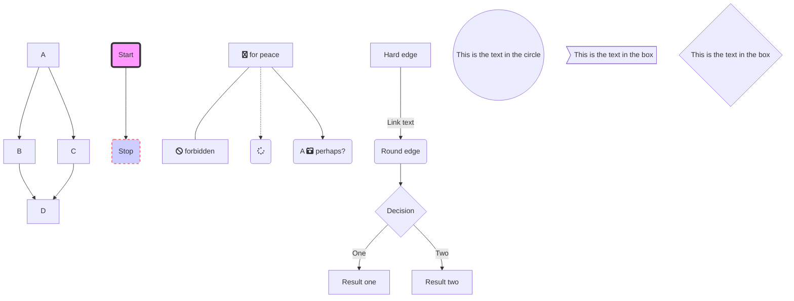
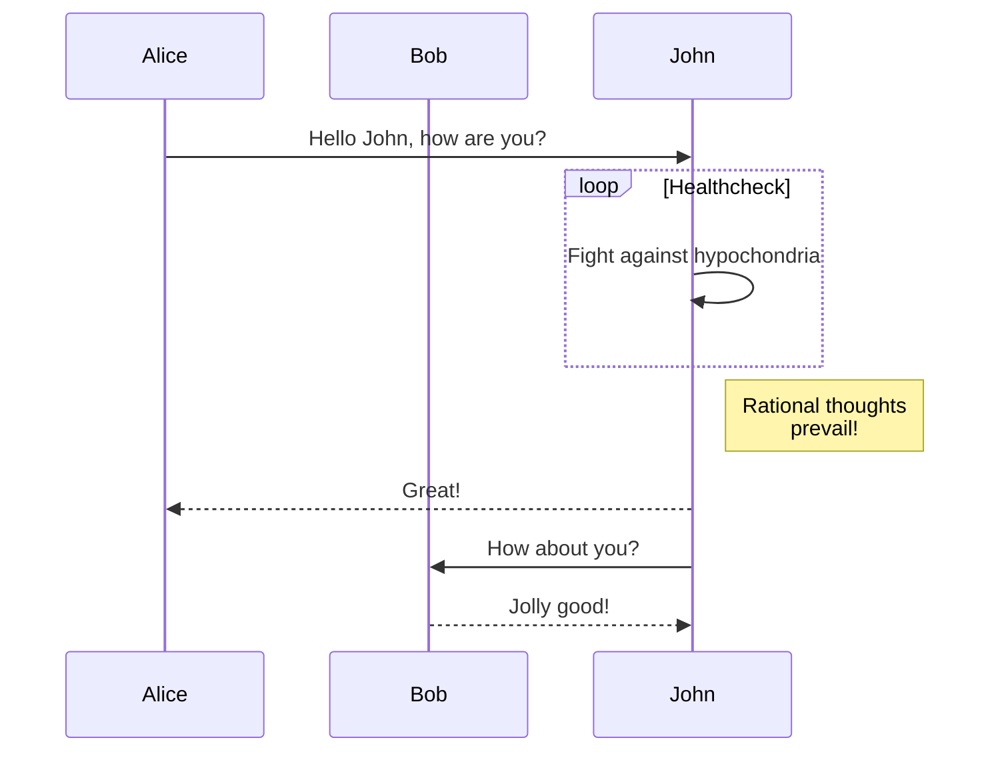
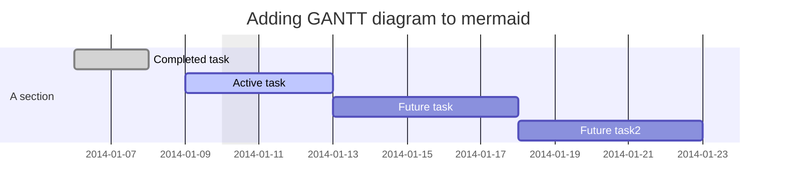
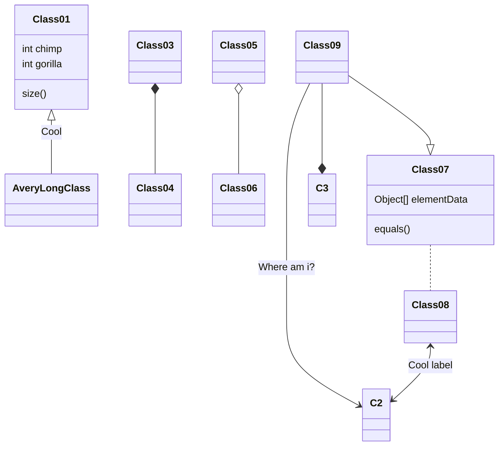
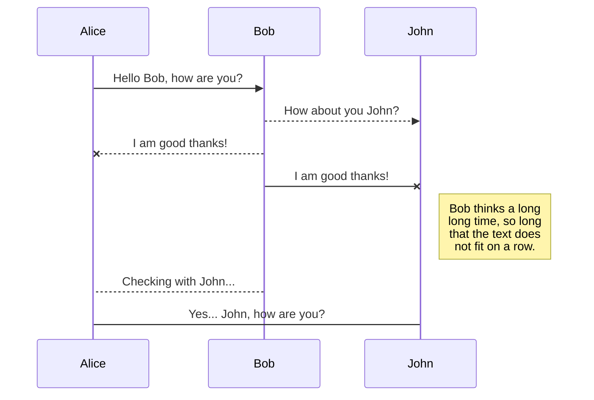

# 帮助

```bash
# python3 运行http服务
python -m http.server 8000
# python2 运行http服务
python -m SimpleHTTPServer 8000

gitbook init //初始化目录文件
gitbook help //列出gitbook所有的命令
gitbook --help //输出gitbook-cli的帮助信息
gitbook install //安装插件
gitbook build //生成静态网页
gitbook serve //生成静态网页并运行服务器
gitbook build --gitbook=2.0.1 //生成时指定gitbook的版本, 本地没有会先下载
gitbook ls //列出本地所有的gitbook版本
gitbook ls-remote //列出远程可用的gitbook版本
gitbook fetch 标签/版本号 //安装对应的gitbook版本
gitbook update //更新到gitbook的最新版本
gitbook uninstall 2.0.1 //卸载对应的gitbook版本
gitbook build --log=debug //指定log的级别
gitbook builid --debug //输出错误信息
https://blog.csdn.net/liudongdong19/article/details/80034835
```

```cach
插件 ,"copy-code-button" 复制代码功能 没用不如用code,可以复制和显行号
```

[mermaid 图](https://github.com/knsv/mermaid)
[mermaid 帮助](http://knsv.github.io/mermaid/#/sequenceDiagram)

%accordion% mermaid示例 %accordion%



%/accordion%









```mermaid


```

```mermaid


```

```mermaid


```

```mermaid


```

```mermaid


```

```mermaid


```

```mermaid


```
