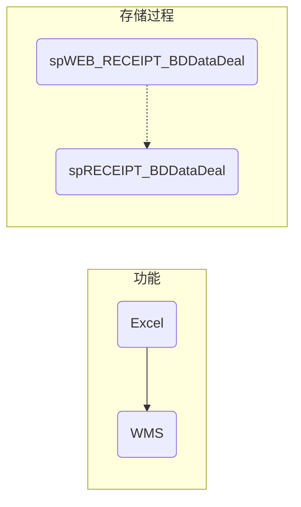
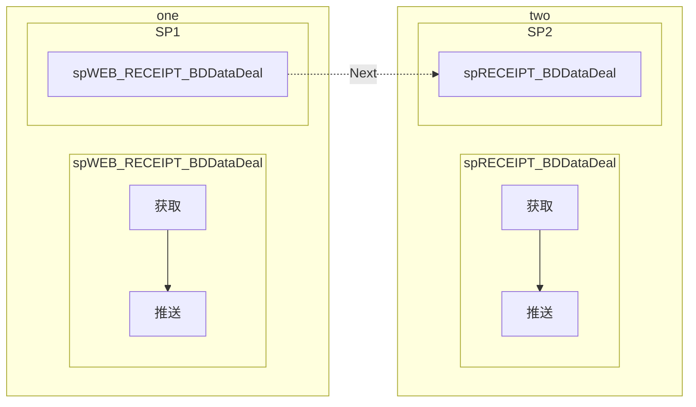
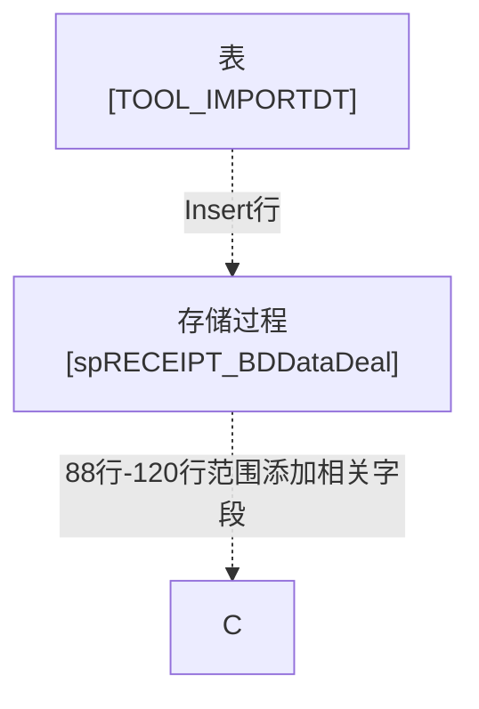

# <center>入库单导入



## 数据库动作

### 通过参数查询需要调用的表名

  ```sql
  exec sp_executesql
  N'SELECT * FROM TOOL_IMPORT WHERE DOCNAME=@DocName AND DOCTYPE=@DocType AND CLIENTID=@ClientID',
  N'@ClientID nvarchar(4000),@DocName nvarchar(4000),@DocType nvarchar(4000)',
  @ClientID=N'CNSHYJ',
  @DocName=N'RECEIPT',
  @DocType=N'STD_DB'
  ```

### 通过参数取出需要导入Excel的字段

  ```sql
  exec sp_executesql
  N'SELECT * FROM TOOL_IMPORTDT WHERE IMPORTID=@ImportID',
  N'@importid nvarchar(4000)',
  @importid=N'RECEIPT'
  ```

### 封装字段

  ```sql

  exec sp_executesql
  N'--获取表数据中的所有 非 自增长字段列表
  SELECT SC.NAME FROM SYSOBJECTS SO, SYSCOLUMNS SC
      WHERE SO.ID = SC.ID
      AND SO.ID = OBJECT_ID(@TableName) AND SO.TYPE = ''U''
      --自增长列定义
      --AND COLUMNPROPERTY(OBJECT_ID(@TableName), SC.NAME, ''ISIDENTITY'') = 0
      ORDER BY SC.COLID;

  --获取表格的主键字段
  SELECT Name FROM SysColumns
      WHERE id=Object_Id(@TableName)
      AND colid IN (SELECT colid FROM sysindexkeys WHERE ID=Object_Id(@TableName));

  --获取表格所有不为空字段且没有默认值且不是自增长列
  SELECT SC.NAME FROM SYSCOLUMNS SC
      WHERE SC.id=OBJECT_ID(@TableName)
      AND SC.isnullable=0
      AND SC.CDEFAULT=0
      AND COLUMNPROPERTY(OBJECT_ID(@TableName), SC.NAME, ''ISIDENTITY'') = 0;',
  N'@TableName nvarchar(4000)',@TableName=N'RECEIPTEXD_BD_TEMP'

  ```

### 发送字段

  ```sql

  exec sp_executesql N'INSERT INTO RECEIPTEXD_BD_TEMP
  (GUID,SHIPADDRESSID,SHIPADDRESS1,ADMISSION,CARRIERREF,WHSREF,ITEMID,DESCRIPTION,LOTTABLE01,LOTTABLE05,QTYEXPECTEDUOM,LOTTABLE10,ETA,UNITPRICE,FROMLINE,STORERID,CONSIGNEEID,POID,ADDBY,ADDDATE,EDITBY,EDITDATE)
  VALUES
  (@RECEIPTEXD_BD_TEMP_GUID,@RECEIPTEXD_BD_TEMP_SHIPADDRESSID,@RECEIPTEXD_BD_TEMP_SHIPADDRESS1,@RECEIPTEXD_BD_TEMP_ADMISSION,@RECEIPTEXD_BD_TEMP_CARRIERREF,@RECEIPTEXD_BD_TEMP_WHSREF,@RECEIPTEXD_BD_TEMP_ITEMID,@RECEIPTEXD_BD_TEMP_DESCRIPTION,@RECEIPTEXD_BD_TEMP_LOTTABLE01,@RECEIPTEXD_BD_TEMP_LOTTABLE05,@RECEIPTEXD_BD_TEMP_QTYEXPECTEDUOM,@RECEIPTEXD_BD_TEMP_LOTTABLE10,@RECEIPTEXD_BD_TEMP_ETA,@RECEIPTEXD_BD_TEMP_UNITPRICE,@RECEIPTEXD_BD_TEMP_FROMLINE,@RECEIPTEXD_BD_TEMP_STORERID,@RECEIPTEXD_BD_TEMP_CONSIGNEEID,@RECEIPTEXD_BD_TEMP_POID,@RECEIPTEXD_BD_TEMP_ADDBY,@RECEIPTEXD_BD_TEMP_ADDDATE,@RECEIPTEXD_BD_TEMP_EDITBY,@RECEIPTEXD_BD_TEMP_EDITDATE);',N'@RECEIPTEXD_BD_TEMP_GUID
  nvarchar(4000),@RECEIPTEXD_BD_TEMP_SHIPADDRESSID nvarchar(4000),@RECEIPTEXD_BD_TEMP_SHIPADDRESS1 nvarchar(4000),@RECEIPTEXD_BD_TEMP_ADMISSION nvarchar(4000),@RECEIPTEXD_BD_TEMP_CARRIERREF nvarchar(4000),@RECEIPTEXD_BD_TEMP_WHSREF nvarchar(4000),@RECEIPTEXD_BD_TEMP_ITEMID nvarchar(4000),@RECEIPTEXD_BD_TEMP_DESCRIPTION nvarchar(4000),@RECEIPTEXD_BD_TEMP_LOTTABLE01 nvarchar(4000),@RECEIPTEXD_BD_TEMP_LOTTABLE05 nvarchar(4000),@RECEIPTEXD_BD_TEMP_QTYEXPECTEDUOM nvarchar(4000),@RECEIPTEXD_BD_TEMP_LOTTABLE10 nvarchar(4000),@RECEIPTEXD_BD_TEMP_ETA nvarchar(4000),@RECEIPTEXD_BD_TEMP_UNITPRICE nvarchar(4000),@RECEIPTEXD_BD_TEMP_FROMLINE nvarchar(4000),@RECEIPTEXD_BD_TEMP_STORERID nvarchar(4000),@RECEIPTEXD_BD_TEMP_CONSIGNEEID nvarchar(4000),@RECEIPTEXD_BD_TEMP_POID nvarchar(4000),@RECEIPTEXD_BD_TEMP_ADDBY nvarchar(4000),@RECEIPTEXD_BD_TEMP_ADDDATE nvarchar(4000),@RECEIPTEXD_BD_TEMP_EDITBY nvarchar(4000),@RECEIPTEXD_BD_TEMP_EDITDATE nvarchar(4000)',@RECEIPTEXD_BD_TEMP_GUID=N'1D2177C5-C721-4594-A156-4531D2C9A7F1',@RECEIPTEXD_BD_TEMP_SHIPADDRESSID=N'P19070036',@RECEIPTEXD_BD_TEMP_SHIPADDRESS1=N'',@RECEIPTEXD_BD_TEMP_ADMISSION=N'',@RECEIPTEXD_BD_TEMP_CARRIERREF=N'',@RECEIPTEXD_BD_TEMP_WHSREF=N'',@RECEIPTEXD_BD_TEMP_ITEMID=N'31215209',@RECEIPTEXD_BD_TEMP_DESCRIPTION=N'',@RECEIPTEXD_BD_TEMP_LOTTABLE01=N'',@RECEIPTEXD_BD_TEMP_LOTTABLE05=N'',@RECEIPTEXD_BD_TEMP_QTYEXPECTEDUOM=N'1',@RECEIPTEXD_BD_TEMP_LOTTABLE10=N'R3-293',@RECEIPTEXD_BD_TEMP_ETA=N'2015-06-01 00:00:00',@RECEIPTEXD_BD_TEMP_UNITPRICE=N'100',@RECEIPTEXD_BD_TEMP_FROMLINE=N'0',@RECEIPTEXD_BD_TEMP_STORERID=N'BD',@RECEIPTEXD_BD_TEMP_CONSIGNEEID=N'BD',@RECEIPTEXD_BD_TEMP_POID=N'Contract',@RECEIPTEXD_BD_TEMP_ADDBY=N'admin',@RECEIPTEXD_BD_TEMP_ADDDATE=N'2019-07-26 15:39:25',@RECEIPTEXD_BD_TEMP_EDITBY=N'admin',@RECEIPTEXD_BD_TEMP_EDITDATE=N'2019-07-26 15:39:25'

  ```

### 推送

  ```sql

  declare @p4 nvarchar(max)
  set @p4=N'<DATA><STATUS>
      <OWNCLIENTID>CNSHYJ</OWNCLIENTID><DOCTYPE>STD_DB</DOCTYPE>
      <KEYVALUE>1D2177C5-C721-4594-A156-4531D2C9A7F1</KEYVALUE><GUID>1D2177C5-C721-4594-A156-4531D2C9A7F1</GUID><OPERATOR>admin</OPERATOR><NEXTSTATUS></NEXTSTATUS>
  </STATUS></DATA>'
  exec spWEB_RECEIPT_BDDataDeal @CallMethod=N'IMPORT',@Token=N'1D2177C5-C721-4594-A156-4531D2C9A7F1',@UserID=N'admin',@Content=@p4 output
  select @p4

  ```

## 存储过程动作



```txt
spWEB_RECEIPT_BDDataDeal
  解析XML
  从 SEC_USER 获取 WHSID CLIENTID CNAME
```

## 修改思路



### 修改表 TOOL_IMPORTDT

%accordion% 为 TOOL_IMPORTDT 表添加以下数据 %accordion%

| IMPORTID | LINENUMBER | FIELDNAME      | FIELDTYPE | COLNUM | COLNAME              | TABLENAME | LOOKNAME | VALUENAME | DEFAULTVALUE | VALUEDEAL |
|----------|------------|----------------|-----------|--------|----------------------|-----------|----------|-----------|--------------|-----------|
| RECEIPT  | 00001      | SHIPADDRESSID  | TEXT      | 6      | Plant                |           |          |           |              |           |
| RECEIPT  | 00002      | SHIPADDRESS1   | TEXT      | 6      | Plant Name           |           |          |           |              |           |
| RECEIPT  | 00003      | ADMISSION      | TEXT      | 3      | PO Number            |           |          |           |              |           |
| RECEIPT  | 00004      | CARRIERREF     | TEXT      | 4      | Shipment Number      |           |          |           |              |           |
| RECEIPT  | 00005      | WHSREF         | TEXT      | 5      | Delivery             |           |          |           |              |           |
| RECEIPT  | 00006      | ITEMID         | TEXT      | 8      | Material             |           |          |           |              |           |
| RECEIPT  | 00007      | DESCRIPTION    | TEXT      | 9      | Material Description |           |          |           |              |           |
| RECEIPT  | 00008      | LOTTABLE01     | TEXT      | 18     | 批次1                  |           |          |           |              |           |
| RECEIPT  | 00009      | LOTTABLE05     | TEXT      | 22     | 过期日期                 |           |          |           |              |           |
| RECEIPT  | 00010      | QTYEXPECTEDUOM | DOUBLE    | 13     | Delivery quantity    |           |          |           | 0            |           |
| RECEIPT  | 00011      | LOTTABLE10     | TEXT      | 6      | Customer PO          |           |          |           |              |           |
| RECEIPT  | 00012      | ETA            | DATE      | 2      | ETR                  |           |          |           | 1900/1/1     |           |
| RECEIPT  | 00013      | UNITPRICE      | DOUBLE    | 15     | Prcie                |           |          |           | 0            |           |
| RECEIPT  | 00014      | FROMLINE       | TEXT      | 7      | LINENUMBER           |           |          |           | 0            |           |
| RECEIPT  | 00015      | STORERID       | TEXT      | 1      | Supplier             |           |          |           |              |           |
| RECEIPT  | 00016      | CONSIGNEEID    | TEXT      | 1      | supplier             |           |          |           |              |           |
| RECEIPT  | 00017      | POID           | TEXT      | 3      | Contract             |           |          |           |              |           |
| RECEIPT  | 00018      | STATUSID       | TEXT      | 16     | 状态                   |           |          |           |              |           |
| RECEIPT  | 00019      | TOLOCID        | TEXT      | 17     | 库位                   |           |          |           |              |           |
| RECEIPT  | 00020      | LOTTABLE07     | TEXT      | 24     | 批次7                  |           |          |           |              |           |
| RECEIPT  | 00021      | QTYREFER       | DOUBLE    | 25     | 箱/包数                 |           |          |           |              |           |
| RECEIPT  | 00022      | QTYRECEIVED    | DOUBLE    | 14     | 已收数量                 |           |          |           |              |           |

%/accordion%

### 修改存储过程

spRECEIPT_BDDataDeal

<button type="button" onclick="alert('aaa')">Click Me!</button>

[2-1][2-1]

[2-1]: https://www.google.com/ "Google"
