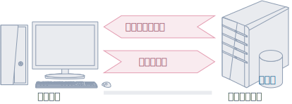
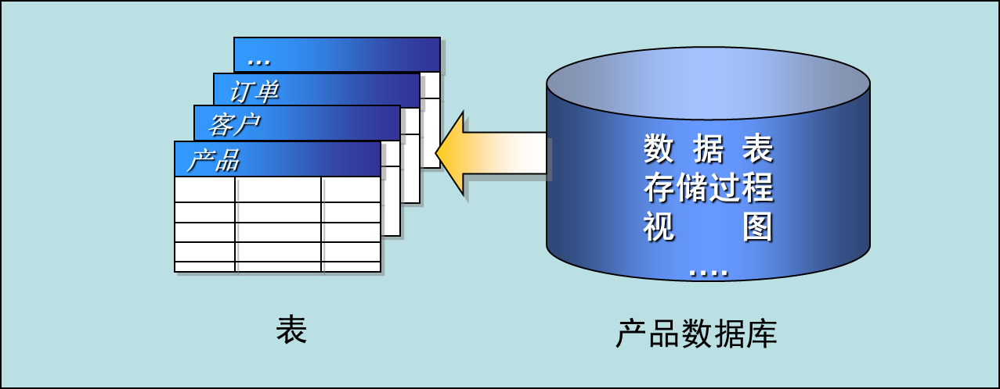
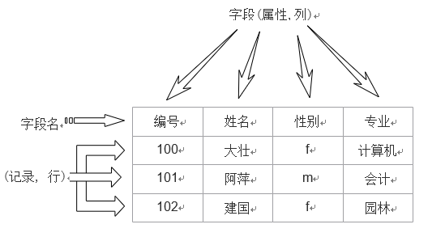
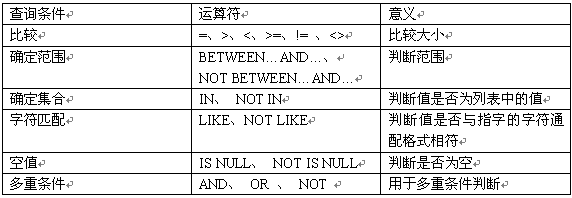
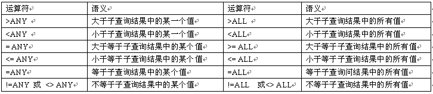

# 初识SQL

## 什么是数据库

狭义；
存储数据的仓库

广义：
可以对数据进行存储和管理的软件以及数据本身统称为数据库

数据库是由表、关系、操作组成

## 数据库的发展史

* 萌芽阶段——文件系统
  * 使用磁盘文件来存储数据
* 初级阶段——第一代数据库
  * 出现了网状模型、层次模型的数据库
* 中级阶段——第二代数据库
  * 关系型数据库和结构化查询语言
* 高级阶段——新一代数据库
  * “关系-对象”型数据库

## 常见的数据库

* Oracle
  * Oracle公司的产品
  * “关系-对象”型数据库
  * 产品免费、服务收费
* SQL Server
  * 针对不同用户群体的五个特殊的版本
  * 易用性好
* My SQL  
  * 是一种开放源代码的数据库
  * 支持多操作系统、多种类型的硬件和设备

## 为什么需要数据库

几乎所有的应用软件的后台都需要数据库

数据库存储数据占用空间小容易持久保存

存储比较安全

容易维护和升级

数据库移植比较容易

简化对数据的操作

为将来学习Oracle做准备

B/S架构里面包含数据库

* 存储数据的方法
  * 第一种方法：用大脑来记住数据
  * 第二种方法：写在纸上
  * 第三种方法：写在计算机的内存中
  * 第四种方法：写成磁盘文件
  * ……

## 数据库能做什么

* 存储大量数据，方便检索和访问
* 保持数据信息的一致、完整
* 共享和安全
* 通过组合分析，产生新的有用信息

## 数据结构和数据库的区别

数据库是在应用软件级别研究数据的存储和操作

数据结构是在系统软件级别研究数据的存储和操作

## 有了编程语言为什么还需要数据库

对内存数据操作是编程语言的强项，但是对硬盘数据操作却是编程语言的弱项

对硬盘数据操作是数据库的强项，是数据库研究的核心问题

## 数据库和应用程序

<table>
<td>

</td>

<td>
<ul> 应用程序
  <li> 作用：响应操作并显示结果、向数据库请求数据
  <li> 要求：美观、操作简单方便
</ul>
<ul> 数据库
  <li> 作用：存储数据、检索数据、生成新的数据
  <li> 要求：统一、安全、性能等
</ul>
</td>
</table>

## 建议初学者从三个方面学习数据库

* 数据库是如何存储数据的
  * 字段记录表约束（主键外键唯一键非空check default 触发器）
* 数据库是如何操作数据的
  * insert update delete T-SQL 存储过程函数触发器
* 数据库是如何显示数据的
  * select (重点的重点）

## 必备的一些操作

如何建数据库

如何删除数据库

如何附加和分离数据库

设置登录用户名和密码

如何创建用户

## 数据库是如何解决数据存储问题的

> 【最基础内容，必须掌握】

### 表的相关数据

* 字段

  一个事物的某一个特征

* 记录

  字段的组合表示的是一个具体的事物
* 表
  
  记录的组合表示的是同一类型事物的集合

  表和字段、记录的关系

  字段是事物的属性

  记录是事物本身

  表是事物的集合

* 列
  
  字段的另一种称谓

* 属性

  字段的另一种称谓

* 元组

  记录的另一种称谓

### CREATE TABLE 命令

通过图形化界面建表

create table 最后一个字段的后面建议不要写逗号
说明；简单掌握后面我们会再详细的介绍

### 什么是约束

* 定义

    对一个表中属性操作的限制叫做约束

* 分类

* 主键约束

    不允许重复元素避免了数据的冗余

* 外键约束

    通过外键约束从语法上保证了本事物所

    关联的其他事物一定是存在的

    事物和事物之间的关系是通过外键来体现的

* check约束

    保证事物属性的取值在合法的范围之内

* default约束

    保证事物的属性一定会有一个值

* 唯一约束

    保证了事物属性的取值不允许重复，

    但允许其中有一列且只能有一列为空

* 问题：

    tm.ique键是否允许多列为空？

* 答案：

    Sq1Server2005只允许一个tm.ique列为空

    OraclellG允许多个tm.ique列为空

    not null

    要求用户必须的为该属性赋一个值，否则语法出错！
    如果—个字段不写null 也不行not null
    则默认是null 即默认允许为空，用户可以不给该字段赋值
    如果用户没有为该字段赋值，则该字段的值默认是null
    要注意null 和default 的区别

* 相同点；

    都允许用户不赋值

* 不同点；

    null修饰的字段如果用户不赋值则默认是null

    default修饰的字段如果用户不赋值则默认是default指定的那个值

### 表和约束的异同

数据库是通过表来解决事物的存储问题的

数据库是通过约束来解决事物取值的有效性和合法性的问题

建表的过程就是指定事物属性及其事物属性各种约束的过程

### 什么是关系

* 定义；

  表和表之间的联系

* 实现方式

通过设置不同形式的外键来体现表和表的不同关系

* 分类（假设是A表和B表）

  * 一对一

    既可以把表A的主键充当表B的外键

    也可以把表B的主键充当表A的外键

  * 一对多【重点】

    把表A的主键充当表B的外键

    或者讲：把A表的主键添加到B表来充当B表的外键

    在多的一方添加外键

  * 多对多

    多对多必须的通过单独的一张表来表示

  * 例子

    班级和教师

    班级是一张表

    教师是一张表

    班级和教师的关系也是一张表

### 主键

#### 主键的含义

定义
能够唯一标示一个事物的一个字段或者多个字段的组合，被称为主键

#### 主键的特点

> 【重点】

```txt
含有主键的表叫做主键表
主键通常都是整数不建议使用字符串当主键（如果主键是用千集群式服务，才可以考虑用字符串当主键）
主键的值通常都不允许修改，除非本记录被删除
主键不要定义成id, 而要定义成表名Id或者表名_id
要用代理主键，不要用业务主键
任何一张表，强烈建议不要使用有业务含义的字段充当主键
我们通常都是在表中单独添加一个整型的编号充当主键字段
主键是否连续增长不是十分重要
```

### 外键

```txt
定义：
如果一个表中的若干个字段是来自另外若干个表的主键或唯一键
则这若干个字段就是外键
注意：
外键通常是来自另外表的主键而不是唯一键，因为唯一键可能为null
外键不一定是来自另外的表，也可能来自本表的主键
含有外键的表叫外建表，外键字段来自的那一张表叫做主键表
问题；
先删主键表还是外建表？
4
答案： 先删外建表
如果先删主键表，会报错，因为这会导致外建表中的数据引用失败
```

## 数据库的操作

数据库就是“数据”的“仓库”

数据库由表、关系以及操作对象组成

数据存放在表中

```txt
2.1  数据库组成
2.2  系统数据库
2.3  创建数据库
2.4  管理数据库

2.1  数据库组成
2.1.1  数据文件
2.1.2  日志文件
2.2  系统数据库
2.2.1  master数据库
2.2.2  model数据库
2.2.3  msdb数据库
2.2.4  tempdb数据库

2.2.1  master数据库
主要记录了sql server 系统的所有的系统信息
2.2.2  model数据库
为临时表和其他临时存储需求提供存储空间
2.2.3  msdb数据库
数据库在 SQL Server 代理程序调度报警和作业时使用
2.2.4  tempdb数据库
为临时表和其他临时存储需求提供存储空间
```



```txt
2.1  数据库组成
2.2  系统数据库
2.3  创建数据库
2.4  管理数据库

2.1  数据库组成
2.1.1  数据文件
2.1.2  日志文件
2.2  系统数据库
2.2.1  master数据库
2.2.2  model数据库
2.2.3  msdb数据库
2.2.4  tempdb数据库

2.2.1  master数据库
主要记录了sql server 系统的所有的系统信息
2.2.2  model数据库
为临时表和其他临时存储需求提供存储空间
2.2.3  msdb数据库
数据库在 SQL Server 代理程序调度报警和作业时使用
2.2.4  tempdb数据库
为临时表和其他临时存储需求提供存储空间


2.3  创建数据库
2.3.1  使用对象资源管理器创建数据库
2.3.2  使用Transact-SQL创建数据库

2.3.1  使用对象资源管理器创建数据库
操用步骤如下：
 (1) 打开”SQL Server Management Studio”的
       窗口，在 ”对象资源管理器” 窗口中的”数据库

       结点” 右击->新建数据库
 (2) 新建数据库窗口，它由“常规”、“选项”和”文件组”三个  
       选项组成。在”常规”选项的“数据库名称”中输入要创新  
       的数据库名称:new_db
        (在“常规”选项中，可以指定数据库名称、数据库
          的逻辑名、初始容量、增长方式和文件路径等。)
  (3)单击“确定”按钮，完成数据库的构建。

2.3.2  使用Transact-SQL创建数据库
```

```sql
CREATE  DATABASE  database_name
 ON PRIMARY
(
NAME= ,
FILENAME= ‘ ’
SIZE=,
MAXSIZE=,
FILEGROWTH=
)
```

```txt
2.4  管理数据库
2.4.1  修改数据库
2.4.2  修改数据库容量
2.4.3  增加数据库容量
2.4.4  缩减数据库容量
2.4.5  查看数据库信息
2.4.6  数据库更名
2.4.7  删除数据库
分离数据库
附加数据库

2.4.1  修改数据库
2.4.2  修改数据库容量
（1）在“对象资源管理器”窗口右击要增加容量的数据库-> ”属性”->选择”文件”，对数据库的分配空间进行数新设定。
         （2）使用T-SQL语句在查询分析器中增加数据库容量
```

```sql
ALTER DATABASE database_name
MODIFY FILE
(
NAME=file_name,
SIZE=newsize
)
```

```txt
2.4.3  增加数据库容量
2.4.4  缩减数据库容量
        (1)在“对象资源管理器”->右击选择要缩减的数据库。
    ”任务”->”收缩”- >”数据库”。单击“确定”期实现数据库的收缩。
        (2)使用T-SQL语句在查询分析器中收缩数据库容量。
      DBCC SHRINKDATABASE(db_name,1)

2.4.5  查看数据库信息
在”对像资源管理器”中展开”数据库”结点，单击要打开的数据库
    数据库信息主要有基本信息、维护信息和空间使用信息等，使用SQL Server管理控制台查看数据库的操作步骤如下：
在“对像资源管理器”窗口中展开“数据库”结点，选择要查看的数据库->右击->选择属性；
在“数据库属性”对话框中，可以查看数据库的基本信息，选择“常规”，“文件”，“文件组”、“选项”、“权限”等选项可以查看到与之相关的数据库信息。

2.4.6  数据库更名
(1)在“对象资源管理器”窗口中,右击要更改名称的数据库->选择”重命名”
(2)在查询分析器中使用T-SLQ命令更改数据库名称。
    EXEC SP_RENAMEDB ‘oldname’ , ’newname’

2.4.7  删除数据库
    (1)在“对象资源管理器”窗口中，右击要删除的数据库->选择“删除”命令。
    (2)在查询分析器中使用T-SQL命令删除数据库。
      DROP DATABASE database_name

分离数据库
  在“对象资源管理器”窗口中，
  右击要分离的数据库->选择“任务”->“分离” 命令
  在强出的“分离数据库”窗口中点击”确定“。即可完成数据库分离工作。

附加数据库
  在“对象资源管理器”窗口中，右击“数据库”结点，->选择“附加”命令，打开“附加数据库”窗口，单击‘添加“按钮，找到要附加数据库的mdf文件,最后单击”确定“按钮，即可完成附加数据库工作。
```

## 数据表的操作

3.1  SQL Server数据库对象
3.2  创建数据表
3.3  管理数据表

SQL Server 数据库中的表是一个非常重要的数据库对象，我们的数据都是存储在各个表中，对数据的访问，验证，关联性连接等都是通过对表的操用来实现的，所以撑据好数据库表的操作，显得非常重要。

### 表的概念

关系数据库的理论基础是关系模型，它直接描述数据库中数据的逻辑结构。关系模型的数据结构它是一种二维表格结构

#### SQL SERVER数据库对象

数据库对象是数据库的组成部分，数据表、视图、索引、存储过程以及触发器等都是数据库对象。



#### 创建数据表

* 数据类型

  数据类型是用来表现数据特征的，它决定了数据在计算机中的存储格式、存储长度、数据精度和小数位数等属性。

常用数据类型

| 数据类型 | 类型         | 描 述                                                                                                                                                   |
| -------- | ------------ | ------------------------------------------------------------------------------------------------------------------------------------------------------- |
| bit      | 逻辑数据类型 | 这种数据类型用于存储只有两种可能值的数据，如 True 或False                                                                                               |
| int      | 整数数据类型 | int 数据类型可以存储从( -2 147 483 648)到 (2147483 647)之间的整数。这种数据类型在数据库里每个值占用4个字节                                              |
| float    | 浮点数据类型 | float 数据类型是一种近似数值类型， 浮点数可以是从-1.79E+308到1.79E+308 之间的任意数                                                                     |
| datetime | 日期时间类型 | datetime数据类型用来表示日期和时间。这种数据类型存储从1753年1月1日到9999年12月3 1日间所有的日期和时间数据， 精确到三百分之一秒或3.33毫秒                |
| CHAR     | 字符数据类型 | char(n) 按固定长度存储字符串,n必须从1-8000 .若输入的数据不足 nB,则补足后存储.若输入的数据过nB，则截断遑存储。                                           |
| VARCHAR  | 字符数据类型 | varchar(n)它与char 类型相似,n必须从1-8000 .之间的数值。存储大小为输入数据字节的实际长度。 由于CHAR 数据类型长度固定，因此它比VARCHAR 类型的处理速度快。 |
| TEXT     | 文本         | TEXT数据类型用于存储大量文本数据，其容量理论上为1 到2的31次方-1 （2 147 483 647）个字节，在实际应用时需要视硬盘的存储空间而定。                         |

```txt
数据库中表的创建
  在SQL Server中建立了数据库后，就可以在该数据库中创建表了。创建表可以在对象资源管理器和在查询分析器中使用T-SQL 语言两种方法进行。
      1、建表的步骤
    (1)定义表结构：给表的每一列取字段名，并确定每一列的数据库型、数据长度、列数据是否可以为空等。
    (2)设置约束：设置约束是为了限制该列输入值的取值范围，以保证输入数据的正确性和统一性。
    (3)添加数据：表结构建立完成之后，应该向表中输入数据。
  “班级”表的结构：

  3.2.2  使用对象资源管理器创建表
  (1)在“对像资源管理器”窗口展开“数据库”结点，选择在其中建立表的数据库，右击“表”结点，在弹出的快捷菜单中选择”新建表”命令。
  (2)在“表设计器” 窗口上的网络中，每一行描述了表中一个字段，每行有三列，这三列分别描术列名，数据类型，和允许为空等信息。

```

```txt
3.2.3  使用Transact-SQL创建表
CREATE TABLE table_name
    (
      学号 INT PRIMARY KEY
             IDENTITY ,
      名称 CHAR(6) NOT NULL ,
      专业方向 VARCHAR(10) NOT NULL ,
      系部代码 CHAR(2) NOT NULL ,
      备注 VARCHAR(50)
    );
表的设计
设计SQL Server 数据库表时，要根据数据库逻辑结构设计的要求，确定需要什么样的表，各表中都有那些数据、所包含的数据类型、那些列允许为空值、那些需要索引、哪些列是主键、哪些列是外键等。在创建和操作表的过程中，将对表进行更为细致的设计。

```

### 管理数据表

#### 修改表结构

一个表建立之后,可以根据使用的需要对它进行修改和删除,修改的内容可以是列的属性,  数据类型、长度等等，还可以添加列、删除列。修改和删除表，可以使用对像资源管理器，也可以使用T-SQL语言完成。

1.在“对象资源管理器”窗口，展开”数据库“结点，选择相应的数据库，展开表对象，右击要修改的表。在弹出菜单中选“修改”。

```sql
--重命名表：
EXEC sp_rename 'old_table_name', 'new_table_name';

--重命名列：
EXEC sp_rename 'table_name.old_name', 'new_name', 'column';

--添加新列：
ALTER TABLE [table_name] ADD [new_column] VARCHAR(33);

--更改列的数据类型：
ALTER TABLE [table_name]  ALTER COLUMN [column_name] [data_type];

--删除列：
ALTER TABLE [table_name] DROP COLUMN [column_name];

--删除表：
DROP TABLE table_name;

--删除表的所有数据
TRUNCATE TABLE [table_name];

--创建主键约束
ALTER TABLE [table_name]
ADD CONSTRAINT pk
PRIMARY KEY CLUSTERED (列名);

--创建外建约束
ALTER TABLE [table_name]
ADD CONSTRAINT wz
FOREIGN KEY (列名)
REFERENCES 表名(列名);
```

修改表字段

修改表约束

#### 查看表中有关信息

```txt
表建立好后，我们可以根据需要查看表的结构和数据，以便更好的管理表。
可以使用对象资源管理器或系统存储过程查看表的结构。
  （1）在”对象资源管理器”窗口中展开 “数据库”结点，选择相应的数据库并展开其中的表结点，右击表选择“属性”。即可查看表信息。
  （2）
    使用系统存储过程sp_help查看表信息。
    EXEC  sp_help table_name

3.3.4  删除表

```

### 临时表

```txt
inserted表和deleted表用于存放对表中数据行的修改信息。他们是触发器执行时自动创建的。当触发器工作完成，它们也被删除。它们是只读表，不能向它们写入内容。

inserted表：用来存储INSERT和UPDATE语句所影响的行的副本。意思就是在inserted表中临时保存了被插入或被更新后的记录行。在执行 INSERT 或UPDATE 语句时，新加行被同时添加到inserted表和触发器表中。

deleted表：用来存储DELETE和UPDATE语句所影响行的副本。意思是在delete表中临时保存了被删除或被更新前的记录行。在执行 DELETE 或 UPDATE 语句时，行从触发器表中删除，并传到deleted表中。所以可以从deleted表中检查删除的数据行是否能删除。

所以当表中某条记录的某项值发生变化时，变化前的值已经通过系统自动创建的临时表deleted表和inserted表保存了被删除行或插入的记录行的副本。我们可以从这两个表中查询出变化前的值并赋给变量。

```

### TRANSACT-SQL语言基础

```txt
4.1  Transact-SQL概述
4.2  如何给标识符起名
4.3  常量
4.4  变量
4.5  运算符和表达式
4.6  Transact-SQL利器——通配符
4.7  Transact-SQL语言中的注释

4.1  Transact-SQL概述
4.1.1  什么是Transact-SQL
4.1.2  T-SQL语法的约定
4.2  如何给标识符起名
1.标识符分类
2.规则标识符
3.界定标识符
4.标识符规则
5.对象命名规则
6.实例的命名规则
4.3  常量
4.3.1  数字常量
4.3.2  字符串常量
4.3.3  日期和时间常量
4.3.4  符号常量
4.4  变量
4.4.1 全局变量
4.4.2 局部变量
4.4.3 批和脚本
4.5  运算符和表达式
4.5.1 算术运算符
4.5.2 比较运算符
4.5.3 逻辑运算符
4.5.4 连接运算符
4.5.5 按位运算符
4.5.6 运算符的优先级
4.5.7 什么是表达式
4.5.8 Transact-SQL表达式的分类
4.6  Transact-SQL利器——通配符
```

| 通配符     | 说明                 | 栗子                       | 匹配值示例                   |
|---------|--------------------|--------------------------|-------------------------|
| %       | 匹配任意长度的字符, 甚至包括零字符 | ‘f%n’匹配字符n前有任意个字符f       | fn,fan,faan,abcn        |
| -       | 匹配单个字符             | ‘b_’匹配以b开头长度为2个字符的值      | ba,by,bx,bp             |
| [字符集合]  | 匹配字符集合中的任何一个字符     | ‘[xz]’匹配x或者y             | dizzy,zebra,x-ray,extra |
| [^]或[!] | 匹配不在括号中的任何字符       | ‘[^abc]’匹配任何不包a、b或者c的字符串 | Desk,fox,f8ke           |

```txt
4.7  Transact-SQL语言中的注释
1.单行注释
单行注释以两个连字符“--”开始，作用范围是从注释符号开始到一行的结束。例如：
--CREATE TABLE temp
--( id INT PRIMAYR KEY, hobby VARCHAR(100) NULL)
2.多行注释
多行注释作用于某一代码块，该种注释使用斜杠星型（/**/），使用这种注释时，编译器将忽略从（/*）开始后面的所有内容，直到遇到（*/）为止。例如：
/*CREATE TABLE temp
--(
```

### 认识函数

```txt
6.1  SQL Server函数简介
聚合函数
6.2  字符串函数
6.3  数学函数
6.4  数据类型转换函数
6.5  文本和图像函数
6.6  日期和时间函数
6.7  系统函数

6.1  SQL Server函数简介
  函数表示对输入参数值返回一个具有特定关系的值，SQL Server提供了大量丰富的函数，在进行数据库管理以及数据的查询和操作时将会经常用到各种函数。
  SQL Server 提供了内置函数帮助用户执行各种操作.内置函数不能修改,可以在T-SQL语句中使用。
  内置函数包括:
      聚合函数、数学函数、配置函数、时间和日期函、
      字符串函数、排名函数，等等。
  聚合函数
  AVG ()--平均值
  COUNT ()--返回行中项目的数量
  MAX ()--最大值
  MIN ()--最小值
  SUM ()--求和

6.2  字符串函数
6.2.1   ASCII()函数
6.2.2   CHAR() 函数
6.2.3   LEFT()函数
6.2.4   RIGHT()函数
6.2.5   LTRIM()函数
  select ltrim('           左边没有空格')   --去空格
  select rtrim('右边没有空格    ') --去空格
  select ltrim(rtrim('    左右都没有空格    ')) --去空格

6.2.6   RTRIM()函数
6.2.7   STR()函数
6.2.8   字符串逆序的函数REVERSE(s)
6.2.9   计算字符串长度的函数LEN(str)
6.2.10   CHARINDEX('d','asdfgh')匹配子串开始位置的函数
6.2.11   SUBSTRING()函数
6.2.12   LOWER()函数
6.2.13   UPPER()函数
6.2.14   替换函数REPLACE(s,s1,s2)
  Select replicate('go',5)--指定的次数重复字符

6.3  数学函数1
6.3.1  绝对值函数ABS(x)和返回圆周率的函数PI()
6.3.2  平方根函数SQRT(x)
6.3.3  获取随机数的函数RAND()和RAND(x)
6.3.4  四舍五入函数ROUND(x,y)
6.3.5  符号函数SIGN(x)
6.3.6  获取整数的函数CEILING(x)和FLOOR(x)
6.3.7  幂运算函数POWER(x,y)、SQUARE ( x)和EXP(x)
6.3.8  对数运算函数LOG(x)和LOG10(x)
6.3.9  角度与弧度相互转换的函数RADIANS(x)和DEGREES(x)
6.3.10  正弦函数SIN(x)和反正弦函数ASIN(x)
6.3.11  余弦函数COS(x)和反余弦函数ACOS(x)
6.3.12  正切函数、反正切函数和余切函数
6.4  数据类型转换函数
 在同时处理不同数据类型的值时，SQL Server一般会自动进行隐式类型转换。这对于数据类型相近的数值是有效的，比如int和float，但是对于其他数据类型，例如整型和字符型数据，隐式转换就无法实现了，此时必须使用显示转换。为了实现这种转换，T-SQL提供了两个显示转换的函数，分别是CAST函数和CONVERT函数。
6.5  文本和图像函数
6.5.1 TEXTPTR函数
6.5.2 TEXTVALID函数
6.6  日期和时间函数
6.6.1  获取系统当前日期的函数GETDATE()
6.6.2  返回UTC日期的函数UTCDATE()
6.6.3  获取天数的函数DAY(d)
6.6.4  获取月份的函数MONTH(d)
6.6.5  获取年份的函数YEAR(d)
6.6.6  获取日期中指定部分字符串值的函数DATENAME(dp,d)
6.6.7  获取日期中指定部分的整数值的函数DATEPART(dp,d)
6.6.8  计算日期和时间的函数DATEADD(dp,num,d)
Year Yy yyyy 年 1753 ~ 9999  
Quarter Qq q 季 1 ~ 4  
Month Mm m 月1 ~ 12  
Day of year Dy y 一年的日数,一年中的第几日 1-366  
Day Dd d 日，1-31  
Weekday Dw w 一周的日数，一周中的第几日 1-7  
Week Wk ww 周，一年中的第几周 0 ~ 51  
Hour Hh h 时0 ~ 23  
Minute Mi n 分钟0 ~ 59  
Second Ss s 秒 0 ~ 59  
Millisecond Ms - 毫秒 0 ~ 999  


6.7  系统函数
6.7.1  返回表中指定字段的长度值
6.7.2  返回表中指定字段的名称
6.7.3  返回数据表达式的数据的实际长度函数
6.7.4  返回数据库的编号
6.7.5  返回数据库的名称
6.7.6  返回当前数据库默认的NULL值
6.7.7  返回服务器端计算机的标识号
6.7.8  返回服务器端计算机的名称
6.7.9  返回数据库对象的编号
6.7.10  返回用户的SID (安全标识号)
6.7.11  返回用户的登录名
6.7.12  返回数据库对象的名称
6.7.13  返回数据库用户的标识号
6.7.14  返回数据库用户名
  SELECT @@VERSION --获取当前数据库版本
  SELECT @@LANGUAGE --当前语言

```

### TRANSACT-SQL查询

```txt
7.1  查询工具的使用
7.2  使用SELECT进行查询
7.3  使用WHERE子句进行条件查询
7.4  使用聚合函数统计汇总
7.5  嵌套查询
7.6  多表连接查询
7.7  外连接
7.8  使用排序函数
7.9  动态查询

7.1  查询工具的使用
7.1.1  编辑查询
7.1.2  查询结果的显示方法
7.2  使用SELECT进行查询
7.2.1  使用星号和列名
7.2.2  使用DISTINCT取消重复
7.2.3  使用TOP返回前n行
7.2.4  修改列标题
7.2.5  在查询结果集中显示字符串
7.2.6  查询的列为表达式
7.3  使用WHERE子句进行条件查询
7.3.1  使用关系表达式查询
7.3.2  使用BETWEEN AND表示范围
7.3.3  使用IN关键字
7.3.4  使用LIKE关键字
7.3.5  使用IS NULL查询空值
7.3.6  使用EXISTS关键字
7.3.7  使用ORDER BY排序
7.3.8  使用GROUP BY分组
7.3.9  使用HAVING对分组结果过滤
7.3.10  使用COMPUTE子句对查询结果小计
7.3.11  使用COMPUTE BY子句分组小计
7.3.12  使用UNION合并查询结果集
7.4  使用聚合函数统计汇总
7.4.1  使用SUM()求列的和
7.4.2  使用AVG()求列平均值
7.4.3  使用MAX()求列最大值
7.4.4  使用MIN()求列最小值
7.4.5  使用COUNT()统计
7.5  嵌套查询
7.5.1  使用比较运算符
7.5.2  使用IN关键字
7.5.3  使用ANY、SOME和ALL关键字
7.5.4  使用EXISTS关键字
7.6  多表连接查询
7.6.1  相等连接
7.6.2  不等连接
7.6.3  带选择条件的连接
7.6.4  自连接
7.7  外连接
7.7.1  左外连接
7.7.2  右外连接
7.7.3  全外连接
7.7.1  左外连接
USE Test
SELECT student.s_id, stu_detail.addr
FROM student LEFT OUTER JOIN stu_detail
ON student.s_id = stu_detail.s_id;7.7.2  右外连接
USE Test
SELECT student.name, stu_detail.s_id
FROM student RIGHT OUTER JOIN stu_detail
ON student.s_id = stu_detail.s_id;7.7.3  全外连接
USE Test
SELECT student.name, stu_detail.addr
FROM student FULL OUTER JOIN stu_detail
ON student.s_id = stu_detail.s_id;交叉连接
USE AdventureWorks2008R2;
GO
SELECT p.BusinessEntityID, t.Name AS Territory
FROM Sales.SalesPerson p
CROSS JOIN Sales.SalesTerritory t
WHERE p.TerritoryID = t.TerritoryID
ORDER BY p.BusinessEntityID;7.8  使用排序函数
1.ROW_NUMBER函数
2.RANK函数
3.DENSE_RANK()函数
4.NTILE()函数

  rank()返回结果集的分区内每行的排名
      rank() over (order by 列名)

7.9  动态查询

  前面介绍的各种查询方法中使用的SQL语句都是固定的，这些语句中的查询条件相关的数据类型都是固定的，这种SQL语句称为静态SQL语句。静态SQL语句在许多情况下不能满足要求，不能编写更为通用的程序，例如有一个学生成绩表，对于学生来说，只想查询自己的成绩，而对于老师来说，可能想要知道班级里面所有学生的成绩。这样一来，不同的用户查询的字段列是不相同的，因此必须在查询之前动态指定查询语句的内容，这种根据实际需要临时组装成的SQL语句，就是动态SQL语句。

```

## 数据的更新

插入数据——INSERT
修改数据——UPDATE
删除数据——DELETE

SQL Server 数据库的新表建好后，表中并不包含任何记录数据，要想实现数据的存储，必须向表中添数据。
  (1)选择须要输入数据的表，右击然后选择打开表。在查询设计器的表中可以输入新记录，也可以修改和删除已经输入的记录。
  (2)在数据的基本操作中，常用到T-SQL语句，来对数据表进行增加，删除，修改，和查询等操作。

```txt
8.1  插入数据——INSERT
  1.1、最简单的insert 语句
    INSERT [into] table_name (column_list) VALUES(data_values)

  [into]是一个可选的关键字，可以将它用在insert和目标表之间。
  table_name 是将要添加数据的表的名称
  (column_list) 是要添加数据的字段名称或字段列表，必须用括写将column_list 括起来，并用逗号进行分隔。若没有指字段列表，则指字全部字段。

1.2 省略values 的insert 语句
  在T-SQL 语言中，有一种简单的插入多行的方法。这种方法使用select 语句查询出的结果代替values 子句.这种语法结构如下：
 INSERT [into] table_name (column_name)  SELECT [column_name] FROM table_name where [search_conditions]
[shere search] 查询条件。
INSERT表和SELECT表的结果集的列数，数据类型必须一致。
[search_conditions]查询条件


8.1.1  插入单行数据
8.1.2  插入多行数据

8.2  修改数据——UPDATE
在数据输入过程中,可能会出现输入错误,或是因为时间变化而需要更改数据。修改表中的数据可以直接打开要修改的表进行更改表的数据。或使用T-SQL进行修改，UPDATE 的语法格式如下：
UPDATE table_name SET  column_name=值 where[search_conditions]

      table_name是需要更新的表的名称。
  SET 是指定要更新的列或变量名称的列名。


8.2.1  修改单行数据
8.2.2  修改多行数据
8.3  删除数据——DELETE
3数据的删除
  随着系统的运行，表中可能产生一些无用的数据，这些数据不仅占用空间，而且还影响查询的速度。删除数据可以使用detelt语句
   DELETE table_name WHERE [search_conditions]
   table_name 是要从其中删除数据的表中名称。
   WHERE 指定用于限制册除行数据的条件。如果没有提供   where子  
              句，则delete 删除表中的所有行。
   [search_conditions]指定删除行的限定条件。

8.3.1  删除部分数据
8.3.2  删除表中所有数据

```

### 简单查询

```txt
    数据库存在的意义在于将数据组织在一起，以方便查询。
  SQL语言中最主要、最核心的部分是查询功能。查询语句用来对
已经存在于数据库的数据按照特定的组合、条件表达式或者一定进检
索。其基本格式是由select 子句、from子句和where 子句组成的
sql查询语句:
 SELECT <列表名>
 FROM  <表或视图名>
 WHERE <查询限定条件>
  也就是说， SELECT指定了要查看的列(字段),from 指定这些数据
的来源(表或视图) WHERE则指定了要查询那些记录

1、输出表中的所有列
   将表中的所有字段都在”结果”窗口列出来，可以有两种方法：一种是将所有字段名在SELECT关键字后列出来；另一种是在SELECT语句后使用一个*
SELECT*FROM table_name
2、输出表中部分列
列出表中的部分字段，可以在SELECT 关键字后依次把字段名写出来，之间用逗号隔开，字段的顺序可根据需要来指定，
SELECT A,B,C FROM table_name

3、选择表中的若干记录
两个不相同的记录，但在某字段上是相同的如果
要去掉结果集中重复的行，可以在字段列表前面加
个DISTINCT关键字。
SELECT DISTINCT 列名 FROM table_name
4、限制返回行数
如果一个表中有上亿条记录，而用户只想看前n条，
这就没有必要显视全部的记录。如果要限定返回的行数，可
以在字段列表前使用TOP n关键字，可以返回结果的前n条记
录信息。
SELECT TOP n  FROM table_name

```

#### 常用的查询条件



```txt
比较大小：
(1) 比较运算符是比较两个表达式的大小的运算符，各运算符的含义是=(等于)、>(大于) 、<(小于) 、>=(大于或等于) 、<=(小于或等于) 、<>(不等于) 、!=(不等于)
(2)确定范围
　确定范围运算符BETWEEN…AND 和NOT BETWEEN…AND…可以找属性值在(或不在)指定的范围内的记录。
(3)确定集合
确定集合运IN 和NOT IN 可以用来查找属性属于(或不属于)指定集合的记
录。
(4)字符匹配
在实际的应用中，用户有时候不能给出精确的查询条件。因此，经常需
要根据一些不确定的信息来查询。T-SQL语言提供了字符匹配运算符
LIKE进行字符串的匹配运算。一般语法格式如下：
    [NOT] LIKE ‘<匹配串>’ [ESCAPE ‘<换码字符>’]
其含义是查找匹配串，与记录相匹配的记录。匹配串可以是完整的字符
串，也可以含有通配符  “%”和“_” 。
百分号，代表可包含任意长度的字符串。
下画线，代表任意单个字符。
(5)涉及空值的查询
  一般情况下，表的每一列都有其存在意义，但有时某些列可能暂时没有确定的值，这时用户可以不输入列的值。那么这列的值为NULL
  空值运算符 IS NULL 用来判断指定的列值是否为空。
  列表达式 [NOT] IS NULL
(6) 多重条件查询
  可以使用逻辑运算符 AND、OR、NOT 连接多个查询条件，实现多条件查询。
  [NOT] 逻辑表达式 AND|OR

```

#### 5. 完整的SELECT 语句的基本语法格式

```txt
虽然select 语句的完整语法较复杂，但是其主要的语法格式可归纳如下：
SELECT select_list
[into new_table_name]
 FROM table_list
[WHERE search_conditions]
[GROUP BY group_by_expression]
[HAVING search_condition]
[ORDER BY  order_expression [asc|desc] ]
 SELECT select_list 描述结果集的列，它是一个逗号分隔的表达式，
 在选择列表中使用 “*”表达式指定返回源表中所有的列
[INTO new_table_name] 用于指定使用结果集来创建一个新表，new_table_name是新表的名称
FROM table_list 结果集数据来源于哪些表或视图。
[WHERE search_conditions]查询条件
GROUP BY group_by_expression    根据列中的值将结果分组。
HAVING search_conditions 结果集附加筛选，通常与GROUP BY 一起使用。
ORDER BY  order_expression [ASC|DESC] 对结果进行分组ASC 和DESC 关键字用于指定行是按升序还是降序排序。

```

#### 6、用查询结果生成新表

```txt
在实际的应用系统中，需要将查询结果保存成一个表，这个
功能可以通过SELECT 语句中的INTO子句实现。
    INTO 新表名
新表名是被创建的新表，查询结果将自动添加到此表中。
新表的字段由结果集中的字段列表决定。
如果表名前加 “#” 则创建的表为临时表。

```

#### 7、对结果进行分组

```txt
  GROUP BY  将查询结果集按某一列或多列值分组，分组列的值相等为一组，并对每一组进行统计。
  GROUP BY 列名 [HAVING 筛选条件表达式]
  “ BY 列名 “是按列名指定的字段进行分组，将该字段值相同的记录组成一组，对每一组记录进行汇总计算并生成一条记录。
      “ HAVING 筛选条件表达式 ”表示对生成的组筛选后再对满足条件的组进行统计。

```

#### 8、对查询的结果排序

  可以使用ORDER BY 对查询结果按照一个或多个属性进行升序(ASC)
  或降序(DESC)排序，默认为升序。
  ORDER BY {列名[ASC|DESC] [,...n] }

#### 9、对数据进行统计

用户经常要对结果集进行统计，例如求和、平均值、最小
值、个数等这些统计可以通过集合函数、COMPUTE子
句，GROUP BY 子句来实现。
使用集合函数
COUNT([DISTINCT| ALL] *)统计记录个数
COUNT ([DISTINCT| ALL] <列名>)统计记录个数。
SUM ([DISTINCT| ALL] <列名>)计算一列值总和(此列必须是数值型)。
AVG([DISTINCT| ALL] <列名>)计算一列值的平均值(此列必须是数值型)。
MAX ([DISTINCT| ALL] <列名>)求一列值中的最大值。
MIN ([DISTINCT| ALL] <列名>)求一列值中的最小值。

#### 10、使用COMPUTE

  对查询结果集中的所有记录进行汇总统计，并显视所有参加汇总记录的详细信息。
  COMPUTE 集合函数 [BY 列名]
  集合函数，例如 SUM() 、AVG()、COUNT()等。
  “BY 列名” 按指定“列名”字段进行分组计算，并显视被统计记录的详细信息。
    BY 选项必须与ORDER BY 一起使用。

#### 11、合并结果集

使用UNION 语句可以将查询结果集合并为一个结果集，也就合并操作语法如下：
  SELECT 语句
  {UNION SELECT 语句}[,…n]
参加UNION操作的各结果集的列数必须相同，对应的数据类型也必须相同。
系统将自己动去掉并集的得复记录。

### 连接查询

```txt
前面所讲的查询是单表查询。若一个查询时涉及两个或两个以上的
表，则称为连接查询。连接查询是关系数据库中最主要的查询，包括
等值与非等值查询、自然连接、自身连接查询、外连接查询和复合条
件连接查询等。交叉连接的语法格式：
SELECT 列表列名 FROM 表名1 CROSS JOIN 表名2
CROSS JOIN   交叉表连接关键字
```

1、交叉连接查询
  (1) 把A表中的所有数据，跟B表中的每一条数据进行拼接，从而形成了的新的数据集
  新数据集=A表所有记录 x B表所有记录

(2)进行拼接时，加个条件语句
  把学生表的每条记录的班级代码，与班级表的表的班级代码进行比较，如果列值相等，则拼接形成一条记录，否则不拼接。
2、自然连接
  用来连接两个表的条件称为连接条件或连接谓词，其中，比较运算符主要是：=、>、<、>=、<=、!=
  等值连接的过程类似于交叉连接，不过它只拼接满足连接条件的记录到结果集中。语法格式为：
  SELECT 列表列名 FROM 表名1 JOIN 表名2  
  ON 表名.列名=表名2.列名
3、自身连接查询
  连接操作既可在多表之间进行，也可以是一个表与其自己进行连接，称为表的自身连接。使用自身连接时，必须为表指定两个别名，以示区别。
select a.姓名,b.性别from 学生 as a  join 学生 as b  on a.学号=b.学号
 4、外连接查询
  外连接的结果集不但包含满足连接条件的行，还包括相应表中的所有行，也就是说，即使某些行不满足连接条件，但仍需要输出该行记录。外连接包括三种：左外连接、右外连接和完全外连接。
  (1)左外连接(LEFT OUTER JOIN)
  左外连接是结果表中除了包含满足连接条件的记录外，还包含左表中不满足连接条件的记录。左表中不满足条件的记录与右表记录拼接时，右表的相应列上填充NULL值。左外连接的语法格式为：
  SELECT 列表列名 FROM 表名1 LEFT [OUTER] JOIN 表名2
  ON 表名1.列名=表名2.列名
(2)右外连接(LEFT OUTER JOIN)
  右外连接是结果表中除了包含满足连接条件的记录外，还包含右表中不满足连接条件的记录。右表中不满足条件的记录与左表记录拼接时，左表的相应列上填充NULL值。右外连接的语法格式为：
  SELECT 列表列名 FROM 表名1 RIGHT [OUTER] JOIN 表名2
  ON 表名1.列名=表名2.列名
(3)完全外连接(FULL OUTER JOIN)
  完全外连接是结果表中除了包含满足连接条件的记录外，还包含右表中不满足连接条件的记录。左(右)表中不满足条件的记录与右(左)表记录拼接时，右(左)表的相应列上填充NULL值。完全外连接的语法格式为
  SELECT 列表列名 FROM 表名1 FULL [OUTER] JOIN 表名2
  ON 表名1.列名=表名2.列名
5、复合连接条件查询
  前面所介绍的连接查询中,ON连接条件表达式只有一个条件,允许ON连接表达式有多个连接条件,称为复合条件连接,或多表连接.
SELECT 学生.学号,学生.姓名,学生.性别,班级.班级名称,专业.专业名称,
系部.系部名称
FROM 学生 JOIN 班级 ON 学生.班级代码=班级.班级代码
    JOIN 专业 ON 学生.专业代码=专业.专业代码
    JOIN 系部 ON 学生.系部代码=系部.系部代码

### 子查询

  将一个查询块嵌套在另一个查询块的WHERE 子句或HAVING 短语条件中的查询叫做嵌套查询。我们把括号内的查询块称为子查询或内层查询，与之相对的概念是父查询或外层查询，即包含子查询的查询块。SQL 允许多层嵌套。但是子查询的SELECT语句中不能使用ORDER BY 子句，ORDER BY 只能对最终查询结果进行排序。

1、带有IN运算符的子查询(IN运算符的子查询返回的结果是集合)
  SELECT 列名 FROM 表名 WHERE 列名 IN
    (SELECT 列名 FROM 表名 WHERE 列名 IN
        SELECT 列名 FROM 表名 WHERE 列名 IN(1,2,3)
    )
2、带有比较运算符的子查询
  父查询与子查询之间通过比较运算符连接，便形成了带有比较运算符的子查询。
  父查询中的一个表达式与子查询返回的结果(单值)进行比较
  (1)带有比较运算符的子查询返回的结果是单值
  (2)若IN的子查询结果集为单值，则”=”符号和IN 可以互换
  SELECT * FROM 表名 WHERE 列名=
    (SELECT 列名 FROM 表名 WHERE 列名=‘X’)
3、带有ANY 或 ALL运算符的子查询
  子查询返回单值时可以使用比较运算符，而使用ANY 或ALL运算符时还必须同时使用比较运算符，带有ANY 或ALL 运算符的子查询的处理过程是：父查询通过ANY 或ALL运算符将父查询中的一个表达式与子查返回结果集中的某个值进行比较。



4、带有EXISTS运算符的子查询
  使用EXISTS运算符后，子查询不返回任何数据，此时，若子查询结果非空(即至小存在一条记录) 则父查询的WHERE 子句返回真(TRUE)，否则返回假(FLASE)
练习： 根据学生姓名查出学生所在的系部信息

## 数据完整性

```txt
数据完整性是指数据的精确性，和可靠性。它是防止数据库中存在
不符合语义规定的数据。“学生” 表中有  ’学号‘,’姓名’,’性别’,’班级代码’,
等等。在这张表中都应该有唯一的学号，不能有两个或多个学生的学
号相同；在 ’性别’ 字段里数据只能为 ’男’ 或 ‘女’  不可能有其它数据。
完整的数据类型分四类：实体完整性、域完整性、参照完整性、用
户定义的完整性。
1、实体完整性
  实体完整性，规定表中的每一行在表中是唯一的实体。也可以这
样说，在表中不可能存在完全相同的记录，主键的存在保证了任何记
录都不重复的。
2、域完整性
域完整性是指数据表中的字段必须满足某种特定的数据类型或约
束。其中约束又包括取值范围、精度等规定。

3、参照完整性
  参照完整性是指两个表的主键和外键的数据应对应一致。它确保
存了主键的表中对应其它表的外键的存在，即保证了表之间数据的一
致性，防止了数据丢失或无意义的数据。禁止在从表中插入包含主表
中不存在的关键字的数据行。
4、用户定义的完整性
不同关系数据库系统根据其应用环境的不同，往往还需要一些特殊的约束条件。用户定义的完整性针对某个特定关系数据库的约束条件，它反映了某一具体应用所涉及的数据必须满足的语义要求。

```

## 规则、默认和完整性约束

```txt
9.1  规则和默认概述
规则是对存储的数据表的列或用户定义数据类型中的值的约束，规则与其作用的表或用户定义数据类型是相互独立的，也就是说，对表或用户定义数据类型的任何操作与对其设置的规则不存在影响。
规则类似于CHECK 约束,是用来限制数据字段的输入值的范围，实现强制数据的域完整性，但是规则不同于CHECK约束，在前面用到的CHECK约束可以针对一个列应用多个CHECK 约束，但一个列不能应用多个规则；规则需要被单独创建，只需要创建一次，以后可以多次使用，可以应用于多个表。

9.2  规则的基本操作
9.2.1  创建规则
规则作为一种数据库对像，在使用前必须被创建。创建规则的语法格式如下：
  CREATE RULE 规则名
  as 条件表达式

9.2.2  绑定规则

2、绑定规则
要使创建好的规则作用到指定的列或表等，还必须将规则绑定到列或用户定义的数据类型上。
EXECUTE sp_bindrule  ‘规则名’,表名.字段名’
3、解绑规则
如果说字段已经不再需要规则输入了，那么必须把已绑定了的规则去掉，这就是解绑规则，在查询分析器中，同样用存储过程来完成解绑定操作，语法如下：
EXECUTE  sp_unbindrule ’表名.字段名’


9.2.3  验证规则作用
9.2.4  取消规则绑定
9.2.5  删除规则
4、删除规则
如果规则已经没有用了，那么可以将其删除。在删除前应该先对规则进行解绑，当规则不再作用于任何表或字段时,可以删除规则。
DROP RULE 规则名称

9.3  默认的基本操作
默认(也称默认值)是一种数据对象，它与DEFAULT(默认)约束的作用相同，也是当向表中插入数据时，没有为列输入值时，系统自动给列赋一个 “默认值”。与DEFAULT 不同的是它类似规则，通过一次定义，可以多次使用。

9.3.1  创建默认
1、创建默认:
  在查询分析器中，创建默认对象的语法格式如下：
CREATE DEFAULT default_name
as 常量表达式,可以包含常量、内置函数或数学表达式
2、绑定默认
  默认值创建之后，必须将其绑定到表的字段才能产生作用，在查询分析器中使用系统存储过程来完成绑定。其语法格式如下：
EXECUTE sp_bindefault  ‘默认名称’,’表名.字段名’
  3、解绑默认值
类似规则，对于不需要再利用默认的列，可以利用系统存储过程对其解绑。其语法格式如下：
EXECUTE sp_bindefault  ’表名.字段名’
4、删除默认值
当默认值不再有存在的必要时，可以将其删除。在删除前，必须先对默认值解绑。在查询分析器中使用DROP语句删除默认值。其语法格式如下：
DROP DEFAULT 默认名称

9.3.2  把自定义默认绑定到列
9.3.3  验证默认作用
9.3.4  取消默认绑定
9.3.5  删除默认
9.4  完整性约束
约束就是一种强制性的规定，在SQL SERVER 2005中提供的约整是通过定义字段的取值规则来维护数据完整性的。在SQL SERVER 中支持6类约束：NOT NULL(非空)约束、CHECK(检查约束)、UNIQUE(唯一束)、PRIMARY KEY (主键 约束)、FOREIGN KEY (外键约束) 和DEFAULT (默认约束)
约束可以在创建表的同时创建，也可以在已有的表上创建。通常，约束可可以在对象资源管理器中创建，也可以在查询分析中中使用SQL命令创建。

9.4.1  主键约束
9.4.2  外键约束
9.4.3  唯一性约束
在一张数据表中，有时候除主键需要具有唯一性，还有某他字段也需要具有唯一性。例如，在 ’系部’ 表中，主键为  ‘系部代码’,但是另外一个字段 ‘系部名称’ 虽然不是主键，但也需要保证它的唯一性，这时就需要创建表中的唯一约束。2.1使用对象资源管理器创建唯一约束
3.1使用对象资源管理器创建唯一约束
  (1)在“对像资源管理器” 窗口中，右击需要设置唯一约束的表，在弹出的菜单选 “修改” 命令，打开 “表设计器”
  (2)在“表设置器” 窗口中，右击需要设置为唯一约束的字段
在弹出的菜单中选择 “索引/键”命令。然后添加唯一约束。
3.2使用SQL 语句创建唯一约束
  为已经存在的表创建唯一约束语法格式如下：
  ALTER TABLE 表名
  ADD CONSTRAINT 唯一约束的名称
  UNIQUE NONCLUSTERED(字段名称)

9.4.4  CHECK约束
4、创建检查约束
检查约束对输入的数据的值做检查，可以限定数据输入，从而维护数据的域完整性。
4.1、使用对象资源管理器创建检查约束
(1)在 “对象资源管理器” 窗口中，右击需要设置唯一约束的表，在弹出的菜单中选“修改”命令。
(2)在 ”表设计器” 窗口中右击需要创建检查约束的字段，选择“CHECK约束”命令，然后添加栓查约束
4.2、 使用SQL 语句创建检查约束
  ALTER TABLE table_name
  ADD CONSTRAINT ck_name
  CHECK(条件)


9.4.5  DEFAULT约束
5、创建默认约束
在用户输入某些数据时,希望一些数据在没输入的情况下被自动输入,这个时候需要对数据表创建默认约束。
5.1、使用对象资源管理器创建检查约束
(1)在 “对象资源管理器” 窗口中，右击需要设置默认约束的表，在弹出的菜单中选“修改”命令。
(2)选择需要创建默认约束的字段，在 “列属性”选项卡中的 “默认值或绑定” 文本框中输入默认值。
5.2使用SQL 语句创建默认约束

ALTER TABLE table_name
ADD CONSTRAINT constraint_name
DEFAULT '默认值' FOR column_name
删除约束
    ALTER TABLE table_name
  DROP CONSTRAINT ck_name


9.4.6  NOT NULL约束

6、查看约束的定义
对于创建好的约束,根据实际需要可以查看其定义信息。SQL Server2005提供了多种查看约束信息的方法，经常使用的有利用对象资源管理器和系统储过程。

利用存储过程查看约束信息
存储过程 sp_helptext 是用来查看约束的一个系统提供的存储过程，可以通过查询分析器来查看约束的名称、创建者、类型和创建时间。其语法格式为：
EXEC sp_help 约束名称
如果该约束有具体的定义和文本，那么可以用sp_helptext来查看其语法格式为：
EXEC sp_helptext 约束名称

```

## 索引

```txt
10.1  索引的含义和特点
数据库中现在有2万条记录，现在要执行这样一个查询：SELECT * FROM table where num=10000。如果没有索引，必须遍历整个表，直到num等于10000的这一行被找到为止；如果在num列上创建索引，SQL Server不需要任何扫描，直接在索引里面找10000，就可以得知这一行的位置。可见，索引的建立可以加快数据库的查询速度。
数据库的索引类似于书籍的索引。在书籍中，索引允许
用户不必翻阅完整个书就能迅速地找到所需要的信息。在
数据库中，索引也允许数据库程序迅速地找到表中的数
据，而不必扫描整个数据库。

优点
1.创建唯一性索引，保证数据库表中每一行数据的唯一性
2.大大加快数据的检索速度，这也是创建索引的最主要的原因
3.加速表和表之间的连接，特别是在实现数据的参考完整性方面特别
有意义。
4.在使用分组和排序子句进行数据检索时，同样可以显著减少查询中
分组和排序的时间。

缺点
1.创建索引和维护索引要耗费时间，这种时间随着数据量的增加而增加
2.索引需要占物理空间，除了数据表占数据空间之外，每一个索引还要占
一定的物理空间。
3.当对表中的数据进行增加、删除和修改的时候，索引也要动态的维护，
降低了数据的维护速度


10.2  索引的分类
不同数据库中提供了不同的索引类型，SQL Server中的索引有两种：聚集索引和非聚集索引。聚集索引和非聚集索引的区别是在物理数据的存储方式上。
聚集索引是指数据行在表中的物理存储顺序 。当为一个表的某列创建聚集索引时，表中的数据会按该列进行重新排序，然后再存储到磁盘上。因此，每个表只能创建一个聚集索引。
非聚集索引与课本中的索引类似。数据存储在一个地方，索引存储在另一个地方，索引带有指针指向数据的存储位置。

10.3  索引的设计原则
（1）索引并非越多越好，一个表中如果有大量的索引，不仅占用大量的磁盘空间，而且会影响INSERT、DELETE、UPDATE等语句的性能。因为当表中数据更改的同时，索引也会进行调整和更新。
（2）避免对经常更新的表进行过多的索引，并且索引中的列尽可能少。而对经常用于查询的字段应该创建索引，但要避免添加不必要的字段。
（3）数据量小的表最好不要使用索引，由于数据较少，查询花费的时间可能比遍历索引的时间还要短，索引可能不会产生优化效果。
（4）在条件表达式中经常用到的、不同值较多的列上建立索引，在不同值少的列上不要建立索引。比如在学生表的“性别”字段上只有“男”与“女”两个不同值，因此就无须建立索引。如果建立索引，不但不会提高查询效率，反而会严重降低更新速度。
（5）当唯一性是某种数据本身的特征时，指定唯一索引。使用唯一索引能够确保定义的列的数据完整性，提高查询速度。
（6）在频繁进行排序或分组（即进行GROUP BY或ORDER BY操作）的列上建立索引，如果待排序的列有多个，可以在这些列上建立组合索引。
10.4  创建索引
10.4.1  使用对象资源管理器创建索引
使用对象资源管器创建索引
  在“对象资源管理器“ 窗口中，选择要建立索引的表，然后展开表结点，右击“索引”结点，在弹出的菜单中选择“新建索引”。

使用CREATE INDEX 语句在查询分析器中创建索引
  CREATE [UNIQUE][CLUSTERED][NONCLUSTERED] INDEX 索引名
  ON 表名(列名)
[UNIQUE]      [CLUSTERED]      [NONCLUSTERED]
唯一索引             聚集索引                非聚集索引

10.4.2  使用T-SQL语句创建索引
10.5  管理和维护索引
在对表创建了索引后，可以根据实际情况，查看表中索引信息。在“对象资源管理器” 窗口中，或系统存储过程sp_helpindex  都可以查看到索引信息。

10.5.1  显示索引信息
右击表中已建的索引，选择属性，打开“索引属性”。
sp_helpindex table_name 查看索引信息
10.5.2  重命名索引
10.5.3  删除索引
使用索引虽然可以提高查询效率，但是对一个表来说，如果索引过多，不但耗费磁盘空间，而且在修改表中记录时会增加服务器维护索引的时间。当不再需要某个索引的时候，应该把它从数据库中删除，这样，既可以提高服务器效，又可以回收被索引占用的存储空间。

展开“表”结点，再展开“索引”结点，右击要删除的索引
DROP INDEX 表名.索引名

```

## 事务和锁

```txt
11.1  事务管理
11.2  锁

11.1  事务管理
11.1.1  事务的原理
11.1.2  事务管理的常用语句
11.1.3  事务的隔离级别
11.1.4  事务的应用案例
11.1.1  事务的原理
1. 事务的含义
2. 事务属性
3. 建立事务应遵循的原则
11.1.2  事务管理的常用语句
SQL Server中常用的事务管理语句包含如下几条：
BEGIN TRANSACTION——建立一个事务
COMMIT TRANSACTION——提交事务
ROLLBACK TRANSACTION——事务失败时执行回滚操作
SAVE TRANSACTION——保存事务
11.1.3  事务的隔离级别
事务具有隔离性，不同事务中所使用的时间必须要和其他事务进行隔离，在同一时间可以有很多个事务正在处理数据，但是每个数据在同一时刻只能有一个事务进行操作。如果将数据锁定，使用数据的事务就必须要排队等待，这样可以防止多个事务互相影响。但是如果有几个事务因为锁定了自己的数据，同时又在等待其他事务释放数据，则造成死锁。
11.2  锁
11.2.1  锁的内涵与作用
11.2.2  可锁定资源与锁的类型
11.2.3  死锁
11.2.4  锁的应用案例
11.2.1  锁的内涵与作用
 数据库中数据的并发操作经常发生，而对数据的并发操作会带来下面一些问题：脏读、幻读、非重复性读取、丢失更新。
11.2.2  可锁定资源与锁的类型
1.可锁定资源
2.锁的类型
11.2.3  死锁
1. 死锁的原因
2. 可能会造成死锁的资源
3. 减少死锁的策略

```

## 游标

```txt
12.1  认识游标
12.2  游标的基本操作
12.3  游标的运用
12.4  使用系统存储过程管理游标

12.1  认识游标
12.1.1  游标的概念
12.1.2  游标的优点
12.1.3  游标的分类

12.1.3  游标的分类
1. Transact-SQL 游标
2. 应用程序编程接口 (API) 服务器游标
3. 客户端游标

12.2  游标的基本操作
12.2.1  声明游标
12.2.2  打开游标
12.2.3  读取游标中的数据
12.2.4  关闭游标
12.2.5  释放游标

12.3  游标的运用
12.3.1  使用游标变量
12.3.2  用游标为变量赋值
12.3.3  用ORDER BY子句改变游标中行的顺序
12.3.4  用游标修改数据
12.3.5  用游标删除数据

12.4  使用系统存储过程管理游标
12.4.1  sp_cursor_list存储过程
12.4.2  sp_describe_cursor存储过程
12.4.3  sp_describe_cursor_columns存储过程
12.4.4  sp_describe_cursor_tables存储过程

```

## 存储过程和自定义函数

```txt
13.1  存储过程概述
13.2  存储过程分类
13.3  创建存储过程
13.4  管理存储过程
13.5  扩展存储过程
13.6  自定义函数

13.1  存储过程概述
存储过程由一组预先编辑好的SQL语句组成。将其放在服务器上，由用户通过指定存储过程的名称来执行。
系统存储过程是SQL Server 2012系统创建的存储过程，它的目的在于能够方便地从系统表中查询信息，或者完成与更新数据库表相关的管理任务或其他的系统管理任务。Transact-SQL语句是SQL Server 2012数据库与应用程序之间的编程接口。在很多情况下，一些代码会被开发者重复编写多次，如果每次都编写相同功能的代码，不但繁琐，容易出错，而且由于SQL Server 2012逐条地执行语句会降低系统的运行效率。

13.2  存储过程分类
13.2.1  系统存储过程
13.2.2  自定义存储过程
13.2.3  扩展存储过程

13.3  创建存储过程
13.3.1  创建存储过程
13.3.2  存储过程调用
对存储在服务器上的存储过程，可以使用EXECUTE命令或其名称执行。

13.3.3  创建带输入参数的存储过程
13.3.4  创建带输出参数的存储过程

13.4  管理存储过程
13.4.1  修改存储过程

13.4.2  查看存储过程信息
对用户建立存储过程，可以使用对象资源管理器或系统存储过程查看该存储过程的定义。
1、使用对象资源管理器查看存储过程，在“对象资源管理器”窗口中，展开“数据库”结点。选择相应的数据库，展开“可编程性”,“存储过程” 结点。
2、使用系统存储过程查看存储过程可以使用 sp_helptext、sp_depends、sp_help 等系统存储过程来查看存储过程的不用信息。

13.4.3  重命名存储过程
13.4.4  删除存储过程
当存储过程不再需要时，可以使用对象资源管理器或  DROP PROCEDURE语句将其删除。


13.5  扩展存储过程
扩展存储过程使用户能够在编程语言（例如，C、C++）中创建自己的外部例程。扩展存储过程的显示方式和执行方式与常规存储过程一样。可以将参数传递给扩展存储过程，而且扩展存储过程也可以返回结果和状态。

13.6  自定义函数
13.6.1  创建标量函数
13.6.2  创建表值函数
13.6.3  删除函数

```

```sql
/*创建存储过程
传递字符串参数A和字符串参数B, 返回A和B组合的结构
*/
create proc spTest
@A varchar(10),
@B varchar(10),
@C varchar(10) Output
as
begin
select @C=@A+@B
end
--执行存储过程
DECLARE @Text VARCHAR(20)
EXEC spTest ‘Hello ’, ‘Word’, @Text OUTPUT
PRINT @Text
```

## 视图

```txt
14.1  视图概述
14.2  创建视图
14.3  修改视图
14.4  查看视图信息
14.5  使用视图修改数据
14.6  删除视图

14.1  视图概述
14.1.1  视图的概念
14.1.2  视图的分类
14.1.3  视图的优点和作用

14.1.1  视图的概念
视图是一个虚似表,和真实的表一样,视图包含一系列带有名称的列和行数据。为了屏蔽数据的复杂性，简化用户对数据的操作，保护数据安全，常常创建不同的视图。
视图是一个虚拟表，是从数据库中一个或多个表中导出来的表。视图还可以在已经存在的视图的基础上定义。
视图一经定义便存储在数据库中，与其相对应的数据并没有像表那样在数据库中再存储一份，通过视图看到的数据只是存放在基本表中的数据。对视图的操作与对表的操作一样，可以对其进行查询、修改和删除。当对通过视图看到的数据进行修改时，相应的基本表的数据也要发生变化，同时，若基本表的数据发生变化，则这种变化也可以自动地反映到视图中。

14.1.2  视图的分类
1. 标准视图
2. 索引视图
3. 分区视图

14.1.3  视图的优点和作用
1 简单化 使用视图，可以简化数据操作。
2 安全性 视图能够对机密数据提供安全保护
3 逻辑数据独立性 可以合并分离的数据，创建分区视图


14.2  创建视图
    创建视图有以下限制
  (1)只能在当前数据库中创建
  (2)用户创建视图嵌套不能超过32层
  (3)不能将规则或默认定义与视图相关
  (4)定义视图查询不能包含COMPUTE 语句和COMPUTE BY 语句

14.2.1  使用视图设计器创建视图
  1、在”对象资源管理器”窗口中，右击图据库下的”视图”结点，在弹出的快捷菜单中选择”新建视图”  命令。

14.2.2  使用T-SQL命令创建视图
  CREATE VIEW  视图名
  WITH [ENCRYPTION] [SCHEMABTNDING]
  AS 查询语句
    [ENCRYPTION]  加密视图
  [SCHEMABTNDING]    视图及表的架构绑定


14.3  修改视图
修改数据包括插入INSERT、删除DELETE、修改 UPDATE 三类

SQL Server中提供了两种修改视图的方法：
1.在SQL Server管理平台中，鼠标右击要修改的视图，从弹出的菜单中选择“设计”选项，出现视图修改对话框。该对话框与创建视图的对话框相同，可以按照创建视图的方法修改视图。
2.使用ALTER VIEW语句修改视图，但首先必须拥有使用视图的权限，然后才能使用ALTER VIEW语句。ALTER VIEW语句的语法格式与CREATE VIEW语法格式基本相同，除了关键字不同。

14.4  查看视图信息

1. 使用SSMS图形化工具查看视图定义信息
2. 使用系统存储过程查看视图定义信息
EXEC sp_helptext  

14.5  使用视图修改数据
14.5.1  通过视图向基本表中插入数据
14.5.2  通过视图修改基本表中的数据
14.5.3  通过视图删除基本表中的数据

14.6  删除视图
  删除视图通常需要显式地使用DROP VIEW 语句进行。

1. 使用对象资源管理器删除视图
2. 使用T-SQL命令删除视图

```

## 触发器

```txt
15.1  触发器概述
15.2  创建DML触发器
15.3  创建DDL触发器
15.4  管理触发器

15.1  触发器概述
15.1.1  什么是触发器
15.1.2  触发器作用
15.1.3  触发器分类

15.1.1  什么是触发器
触发器是一种特殊类型的存储过程，它不是由用户直接调用的，而是当用户对数据进行操作   (包括数据的    INSERT、UPDATE、DELETE操作)时自动执行。
触发器是一个在修改指定表值的数据时执行的存储过程，不同的是执行存储过程要使用EXEC语句来调用，而触发器的执行不需要使用EXEC语句来调用，通过创建触发器可以保证不同表中的逻辑相关数据的引用完整性或一致性。

15.1.2  触发器作用
触发器的主要作用就是其能够实现由主键和外键所不能保证的复杂的参照完整性和数据的一致性，它能够对数据库中的相关表进行级联修改，能提供比CHECK约束更复杂的数据完整性，并自定义错误信息。

触发器的优点
(1)触发器自动执行.在对表中的数据做了任何修改之后立即被激活.
(2)触发器能够对数据库中的相关表实现级联更改.


15.1.3  触发器分类
1. 数据操作语言触发器
2. 数据定义语言触发器


15.2  创建DML触发器
15.2.1  INSERT触发器
15.2.2  DELETE触发器
15.2.3  UPDATE触发器
15.2.4  替代触发器
15.2.5  允许使用嵌套触发器
15.2.6  递归触发器

15.3  创建DDL触发器
15.3.1  创建DDL触发器的语法
15.3.2  创建服务器作用域的DDL触发器

15.4  管理触发器
15.4.1  查看触发器
SQL Server 提供了一个专门用于查看表的触发器信息的系统存储过程 sp_helptrigger

15.4.2  修改触发器
15.4.3  删除触发器
当不再需要某个触发器时，可以将其删除。DROP TRIGGER

15.4.4  启用和禁用触发器

创建触发器
  CREATE TRIGGER trigger_name
  ON { table | view }
  FOR  {[INSERT],[DELETE],[UPDATE]}
  SQL语句

```

## 数据库的备份与恢复

```txt
17.1  备份与恢复介绍
17.2  备份设备
17.3  使用T-SQL语言备份数据库
17.4  在SQL Server Management Studio中还原数据库
17.5  用T-SQL语言还原数据库
17.6  建立自动备份的维护计划

17.1  备份与恢复介绍
17.1.1  备份类型
17.1.2  恢复模式
17.1.3  配置恢复模式

17.2  备份设备
17.2.1  备份设备类型
17.2.2  创建备份设备
17.2.3  查看备份设备
17.2.4  删除备份设备

17.3  使用T-SQL语言备份数据库
17.3.1  完整备份与差异备份
17.3.2  文件和文件组备份
17.3.3  事务日志备份

17.4  在SQL Server Management Studio中还原数据库
17.4.1  还原数据库的方式
17.4.2  还原数据库前要注意的事项
17.4.3  还原数据库备份
17.4.4  还原文件和文件组备份

17.5  用T-SQL语言还原数据库
17.5.1  完整备份还原
17.5.2  差异备份还原
17.5.3  事务日志备份还原
17.5.4  文件和文件组备份还原
17.5.5  将数据库还原到某个时间点
17.5.6  将文件还原到新位置上

17.6  建立自动备份的维护计划
数据库备份非常重要，并且有些数据的备份非常频繁，例如事务日志，如果每次都要把备份的流程执行一遍，那将花费大量的时间，非常繁琐和没有效率。

```
